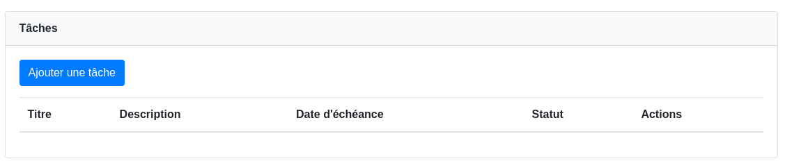
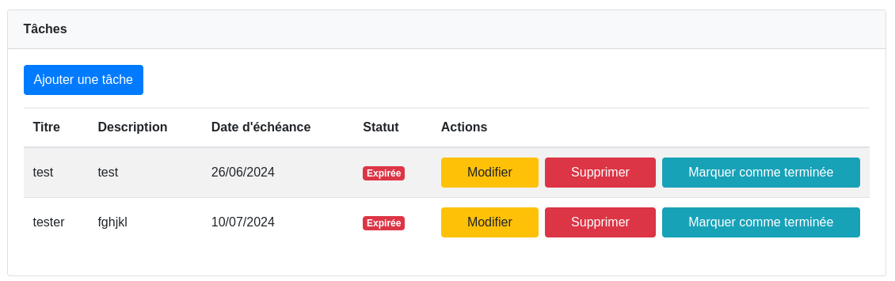
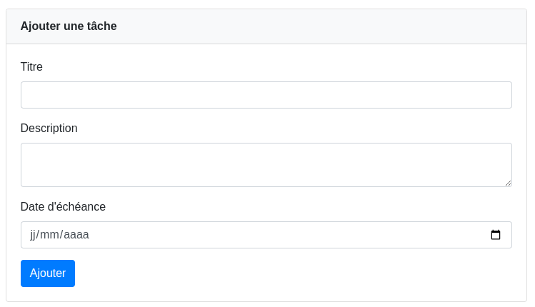

# Implémentation de Fonctionnalités
Je vous invite à implémenter a implementer les fonctionnalités suivantes pour continuer le projet task manager.

1) **Implementez la fonctionnalité d'ajout d'une tâche**
faire en sorte que le clic sur le lien Mes Tâches produit comme resultat l'affichage de la page task_list.php (à creer) cette page doit afficher la liste des taches de l'utilisateur qui est actuelement connecté deux cas sont possible:
    - Le cas ou l'utilisateur n'a aucune tache image suivante
    
    - Le cas ou l'utilisateur a deja des taches image suivante
    
2) **Implementez la fonctionnalité d'ajout d'une tache**
faire en sorte que le clic sur le bouton Ajouter une Tache affiche la page add_task.php (à creer) image suivante.

le clic sur le bouton Ajouter du formulaire qui permet d'ajouter une tache permet d'enregistrer le nom de la tache, la description, la date de fin, l'identifiant de l'utilisateur proprietaire de la tache (notez que c'est l'identifiant de l'utilisateur actuelement connecté pensez a le recuperer dans la session)

php -S localhost:8888
